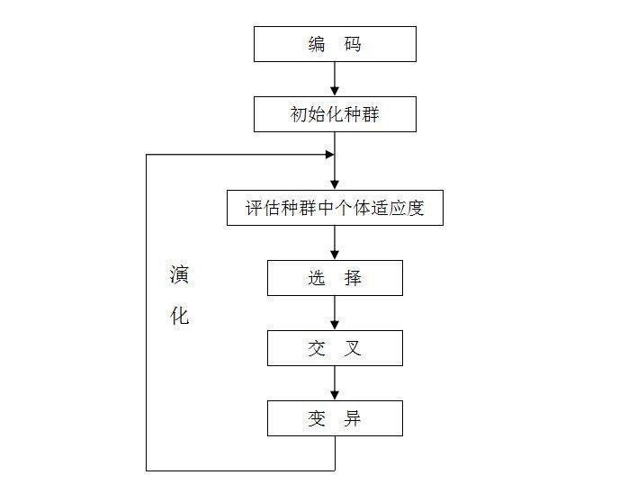
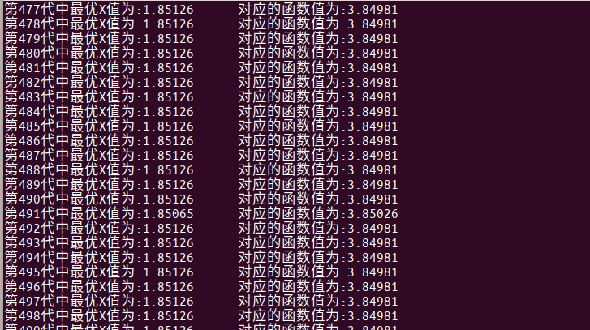

# 遗传算法求解一元函数的最值

## 一、遗传算法原理简介

1、算法原理



遗传算法可以用来求函数的极值。 
 （1）初始化种群：用二进制编码(还有其他编码方式)来离散自变量，码长根据离散精度来确定。码长为:
$$
log2[(max-min)/精度 + 1 ]
$$
 （2）评估适应度函数：解码并求解该值下的目标函数值。
 （3）选择策略采用：选择一些染色体来产生下一代。一种常用的选择策略是 **“比例选择”**，也就是个体被选中的概率与其适应度函数值成正比。假设群体的个体总数是M，那么那么一个体Xi被选中的概率为f(Xi)/( f(X1) + f(X2) + …….. + f(Xn) ) 。比例选择实现算法就是所谓的轮盘赌策略（**Roulette Wheel Selection**）

 （4）交叉：单点交叉，或整个基因交叉（即互换两个基因的数组的每个元素）
 （5）变异：是根据变异概率反转子代数组某位值 ,由于是二进制编码，子代基因某个位置只有两种状态(0、1)。


## 二、代码运行

​	将代码 git clone 到你自己的 Ubuntu 上，然后打开终端，cd 到 本代码的 src 目录下，编译GA_main.cpp ：

```bash
g++ GA_main.cpp      # 如果编码成功，则继续执行下有一步骤
./a.out                             # a.out 是G++ 或Gcc的默认生成的可执行文件名
```

正确的运行结果如下：

# GA-solve-functions
# GA-solve-function
# GA-solve-function
# GA-solve-function
